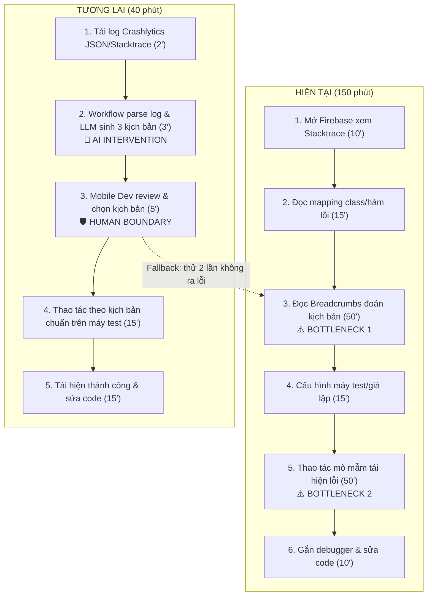
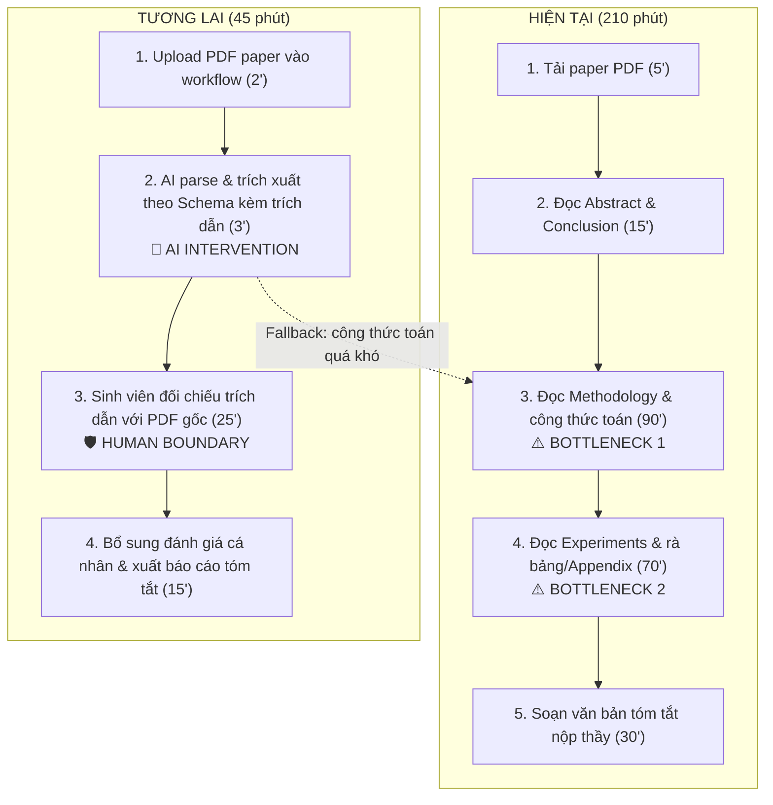

# 01 — Individual Problem Scan

> Điền theo Phase 1 + Phase 2 trong `01-worksheet.md`. Tự scan trước, dùng AI sau để phản biện. Không copy ví dụ Weekly Report.

## Thông tin cá nhân

- Họ và tên: Chu Phúc Anh
- Mã học viên: 2A202602370
- Vai trò / bối cảnh: Sinh viên năm cuối ĐHBK Hà Nội (chuyên ngành Khoa học Máy tính), Intern Mobile Engineer
- Công việc hằng tuần:
  - Phát triển và sửa lỗi tính năng ứng dụng di động; tích hợp API backend từ Swagger/Postman vào Data Model/Service layer.
  - Điều tra crash/bug log từ Firebase Crashlytics và tái hiện lỗi trên các dòng thiết bị/OS Android & iOS khác nhau.
  - Tham gia Daily Standup, Sprint Planning và viết báo cáo tiến độ tuần cho mentor/team lead.
  - Nghiên cứu tài liệu học thuật, đọc paper và làm thí nghiệm/viết báo cáo đồ án tốt nghiệp năm cuối tại ĐHBK Hà Nội.
  - Chuẩn bị bản build test (APK/IPA), kiểm tra checklist và viết release notes sơ bộ trước khi bàn giao cho QA.

---

## Phase 1 — Scan 5+ problems (tối thiểu 5, khuyến khích 8-10)

**Cách điền:** mỗi dòng = việc gì + ai chịu + đo bằng gì. Cột `Dấu hiệu thật` bắt buộc có số: mất bao lâu (bấm giờ mấy lần), mấy lần/tuần, bao nhiêu người gặp, log/ticket/quote nào.

| # | Lăng kính (Lặp lại / Tốn thời gian / AI có thể tốt hơn / Pain từ người khác) | Problem quan sát được | Ai chịu ảnh hưởng? | Dấu hiệu thật (số + bằng chứng) |
|---|---|---|---|---|
| 1 | Lặp lại | Viết code boilerplate mapping DTO/Model từ tài liệu Swagger/Postman JSON sang Kotlin/Swift data classes mỗi khi Backend cập nhật API spec | Mobile dev (bản thân & đồng nghiệp trong team app) | 3-4 lần/sprint, mất 45-60 phút/lần ngồi gõ thủ công model; sprint trước bị 2 bug crash runtime do BE đổi camelCase sang snake_case mà FE cập nhật sót. |
| 2 | Tốn thời gian | Điều tra và tái hiện lỗi Crash report từ Firebase Crashlytics trên các dòng máy Android đời cũ hoặc hãng đặc thù (Xiaomi, Oppo, Samsung) | Mobile dev phụ trách bug triage, QA tester | 2-3 crash report/tuần, mất 2-3 tiếng/lỗi để đọc stack trace hỗn loạn, tìm thiết bị test phù hợp và đoán kịch bản thao tác của user trước khi crash. |
| 3 | Pain từ người khác | QA và Mobile Dev tranh cãi, hỏi đi hỏi lại nhiều vòng về reproduction steps do ticket bug trên Jira/Trello ghi quá vắn tắt, thiếu log | QA tester và Mobile dev (Junior/Intern) | 4/10 bug ticket gửi sang bị dev bấm "Cannot Reproduce"; mất 2-3 lượt nhắn tin Slack (~30 phút/ticket) để yêu cầu QA quay lại màn hình hoặc xuất logcat. |
| 4 | Lặp lại | Viết Release Notes và kiểm tra checklist thủ công trước mỗi bản build test gửi QA (version name, build code, link Swagger API staging/prod, changelog Git PR) | Mobile dev build app, QA Lead | 2 lần/tuần, mất 35-40 phút/lần để rà từng commit/PR trên GitLab, format lại danh sách tính năng thay đổi; từng 1 lần gửi nhầm build nối nhầm URL Staging sang TestFlight. |
| 5 | AI có thể tốt hơn | Tìm kiếm và tổng hợp giải pháp fix lỗi cấu hình build Gradle / Xcode Signing certificates từ tài liệu nội bộ và thread Slack cũ | Mobile intern / dev mới onboard | Mất 1.5 - 2 tiếng tra cứu Google, StackOverflow khi gặp lỗi chứng chỉ Apple Dev; hỏi lead thì nhận được câu: "Lỗi này team fix nửa năm trước rồi, em tìm trong thread Slack dự án đi". |
| 6 | Tốn thời gian | Đọc, phân loại và tóm tắt các bài báo khoa học (paper) tiếng Anh nhiều trang, công thức toán phức tạp phục vụ Đồ án tốt nghiệp KHMT Bách Khoa | Sinh viên năm cuối KHMT (bản thân và nhóm đồ án) | Cần đọc 2-3 paper/tuần (12-15 trang/paper), mất 3-4 tiếng/paper để nắm được baseline model, dataset và kết quả thực nghiệm; thường xuyên trễ hạn nộp tóm tắt tuần cho thầy. |
| 7 | Pain từ người khác | Giảng viên hướng dẫn đồ án phàn nàn vì báo cáo tiến độ tuần của nhóm viết rời rạc, không rõ phần code nào đã hoàn thành so với mục tiêu đề ra | Giảng viên hướng dẫn (GVHD) và 3 thành viên nhóm đồ án | 2 tuần liên tiếp trong buổi họp định kỳ (30 phút/tuần), thầy nhắc nhở mất 15 phút đầu chỉ để giải thích lại tuần này mỗi người đã đẩy code giải thuật gì lên GitHub. |
| 8 | AI có thể tốt hơn | Rà soát và giải thích logcat / raw network logs từ Charles Proxy / Flipper khi app gọi API bị mã lỗi 4xx/5xx bất thường | Mobile dev khi phối hợp debug với Backend dev | 1-2 lần/tuần, mất 40 phút vừa parse JSON raw payload vừa đối chiếu với API spec xem thiếu header Authorization hay sai định dạng enum. |

> Gợi ý tự soi: tuần trước mất nhiều thời gian nhất vào việc gì? Việc gì hay trì hoãn? Người khác hay hỏi lại câu gì? Workflow nào ai cũng biết là chậm?

**AI đã dùng ở Phase 1 (nếu có):**
- Prompt đã hỏi: "Tôi là sinh viên năm cuối KHMT ĐHBK Hà Nội kiêm Intern Mobile Engineer. Hãy đóng vai một tech lead phản biện, gợi ý thêm các pain point thực tế trong quy trình làm app di động và nghiên cứu đồ án tốt nghiệp theo 4 lăng kính."
- Ý dùng được: Gợi ý bóc tách lỗi Crashlytics không có ngữ cảnh thao tác của user, và vấn đề mapping DTO từ Swagger/Postman sang Data Model.
- Ý bỏ vì không phải pain thật: Ý tưởng "AI tự động code hoàn chỉnh toàn bộ màn hình app từ bản vẽ Figma" (quá rộng, không thực tế và khó kiểm chứng trong khuôn khổ lab).

**Self-check Phase 1:**
- [x] Đủ 5+ dòng, mỗi dòng có actor + số đo cụ thể (đã có 8 bài toán cụ thể)
- [x] Dùng ít nhất 3/4 lăng kính (đầy đủ cả 4 lăng kính)
- [x] Không có dòng chung chung kiểu "mất nhiều thời gian"

---

## Phase 2 — Top 3 Problem Cards

### 2.1. Chọn top 3

Giữ bài nào: actor cụ thể, workflow vẽ được 3-7 bước, bottleneck ở 1 bước, impact đo được. Loại bài quá rộng.

| Rank | Problem (copy từ bảng scan) | Vì sao chọn (2-3 ý) | Điều còn chưa chắc |
|---|---|---|---|
| 1 | Điều tra và tái hiện lỗi Crash report từ Firebase Crashlytics trên các dòng máy Android đời cũ hoặc hãng đặc thù | - Trải nghiệm thực tế sâu sắc trong công việc intern hàng tuần.<br>- Workflow hiện tại tốn nhiều thời gian nhất (2-3h/lỗi).<br>- Đóng góp trực tiếp vào chỉ số Crash-free users của app. | Liệu AI có hiểu được context logic nghiệp vụ riêng của app để suy ra hành vi người dùng từ breadcrumbs không? |
| 2 | QA và Mobile Dev tranh cãi, hỏi đi hỏi lại nhiều vòng về reproduction steps do ticket bug trên Jira/Trello ghi quá vắn tắt, thiếu log | - Là điểm nghẽn giao tiếp điển hình giữa 2 team.<br>- Giảm thiểu lãng phí thời gian handoff qua lại.<br>- Có thể kết hợp giải pháp Rule + AI hỗ trợ. | QA có sẵn sàng đổi quy trình tạo ticket và cài thêm extension/tool ghi log không? |
| 3 | Đọc, phân loại và tóm tắt các bài báo khoa học (paper) tiếng Anh nhiều trang, công thức toán phức tạp phục vụ Đồ án tốt nghiệp KHMT | - Pain point cấp thiết của sinh viên năm cuối Bách Khoa.<br>- Đo lường được rõ ràng (thời gian đọc/paper, độ chính xác thông tin trích xuất).<br>- Giúp trực tiếp đẩy nhanh tiến độ tốt nghiệp. | AI có khả năng trích xuất chính xác công thức toán phức tạp và sơ đồ kiến trúc không bị hallucination không? |

### 2.2. Problem Cards chi tiết (lặp lại cho cả 3 cards)

---

#### Problem Card #1 — Định vị nguyên nhân và tái hiện Crash từ Firebase Crashlytics

```text
Problem 1 câu: Mobile Engineer mất 2-3 tiếng mỗi ca crash trên Firebase Crashlytics vì chuỗi log và breadcrumbs rời rạc, khó đoán được chuỗi thao tác thực tế của người dùng để tái hiện lỗi trên máy test.

Actor: Mobile Engineer (Intern/Junior phụ trách triage bug và độ ổn định ứng dụng).

Thời điểm / bối cảnh: Trong các đợt phát hành phiên bản mới (Release/Hotfix) hoặc khi dashboard Firebase báo tỷ lệ crash tăng đột biến.

Current workflow 3-7 bước:
1. Mở Firebase Crashlytics Dashboard, kiểm tra stacktrace của issue có số lượng crash cao nhất.
2. Đọc file mapping và stacktrace để xác định class/hàm và dòng code bị ném exception (thường là NullPointerException hoặc OutOfMemory).
3. Đọc ngược danh sách Breadcrumbs (user actions, network calls, screen views) trước thời điểm crash để đoán hành vi người dùng.
4. Mượn thiết bị test hoặc tạo máy ảo (Android Emulator) có cấu hình OS và độ phân giải tương đương với báo cáo crash.
5. Thực hiện thao tác thủ công nhiều lần trên app để cố gắng tái hiện lại lỗi theo kịch bản suy đoán.
6. Khi tái hiện được: gắn debugger, tìm nguyên nhân gốc rễ, sửa code và viết unit test.

Bottleneck: Bước 3 & 5: Dịch chuỗi Breadcrumbs vụn vặt thành một "Kịch bản tái hiện cụ thể từng bước" (Step-by-step reproduction scenario) mất tới 60-90 phút và nhiều lần đoán sai.

Impact: Mỗi tuần tốn 6-8 tiếng của dev; tỷ lệ crash-free users giảm dưới 99%; chậm tiến độ fix bug nghiêm trọng ảnh hưởng đến đánh giá của người dùng trên Google Play/App Store.

Success metric:
- Baseline: Mất trung bình 150 phút để triage và tái hiện 1 ca crash; tỷ lệ tái hiện thành công lần đầu đạt ~45%.
- Target: Giảm thời gian triage & tái hiện xuống dưới 40 phút/ca; tỷ lệ tái hiện thành công đạt >= 75%.
- Cách đo: Bấm giờ từ lúc nhận ticket crash đến lúc tái hiện được bug trên môi trường dev nội bộ.

Non-AI alternative: 
Quy định dev phải gắn thêm thật nhiều custom log sự kiện (Analytics) ở mọi nút bấm và màn hình, hoặc ép người dùng gửi kèm video/feedback (tuy nhiên làm tăng dung lượng app, tốn băng thông và người dùng thường bỏ qua).

AI hypothesis: 
Mô hình ngôn ngữ (LLM) có khả năng đọc chuỗi Breadcrumbs + Stacktrace thô và đối chiếu với sơ đồ màn hình để sinh ra 3 kịch bản thao tác người dùng khả dĩ nhất kèm theo dữ liệu test đầu vào tương ứng.

Quick gut:
[ ] No AI / process fix
[ ] Rule
[x] Workflow
[ ] Agent
[ ] Chưa biết
```

**Draft workflow Card #1** (ASCII / Mermaid / ảnh đính kèm):

```text
CURRENT STATE — 150 phút

[1. Mở Firebase xem stacktrace: 10']
→ [2. Đọc mapping class/hàm lỗi: 15']
→ [3. Phân tích Breadcrumbs đoán kịch bản: 50']  <-- bottleneck 1
→ [4. Cấu hình máy test/giả lập: 15']
→ [5. Thao tác mò mẫm tái hiện lỗi: 50']         <-- bottleneck 2
→ [6. Gắn debugger & sửa code: 10']

FUTURE STATE — 40 phút

[1. Tải log Crashlytics JSON/Stacktrace: 2']
→ [2. Workflow tự động: Parse log + LLM sinh 3 kịch bản tái hiện từng bước: 3']
→ [3. Mobile Dev review kịch bản & chọn kịch bản khả thi nhất: 5']  <-- human boundary
→ [4. Cấu hình thiết bị & chạy theo kịch bản chuẩn hóa: 15']
→ [5. Tái hiện thành công & sửa code: 15']

Fallback: Nếu 3 kịch bản AI đưa ra không tái hiện được lỗi sau 2 lần thử, dev chủ động quay về quy trình phân tích thủ công truyền thống và gắn thêm log phụ trợ.
```



File đính kèm (nếu vẽ riêng): `01-individual-problem-scan-workflow-card-1.png`

---

#### Problem Card #2 — Chuẩn hóa và làm giàu dữ liệu Bug Ticket giữa QA và Dev

```text
Problem 1 câu: QA và Mobile Dev lãng phí 30-45 phút trên mỗi ticket bug vì mô tả lỗi trên Jira/Trello ghi quá ngắn gọn, thiếu thông tin môi trường và video minh họa, khiến dev phải trả về trạng thái "Cannot Reproduce".

Actor: QA Tester và Mobile Engineer (đặc biệt là thành viên mới onboard / Intern).

Thời điểm / bối cảnh: Giai đoạn kiểm thử Sprint cuối (Feature Freeze) hoặc chuẩn bị Release ứng dụng.

Current workflow 3-7 bước:
1. QA phát hiện hành vi bất thường trên app khi test.
2. QA điền form tạo bug trên Jira: tiêu đề ngắn, mô tả 1-2 dòng tóm tắt, có thể đính kèm 1 ảnh chụp màn hình.
3. Dev nhận thông báo ticket, kéo branch về máy và chạy thử theo mô tả của QA nhưng không thấy lỗi xuất hiện.
4. Dev chuyển trạng thái ticket sang "Cannot Reproduce" và tag QA trên kênh Slack hỏi thêm chi tiết.
5. QA đọc Slack, cài lại app, quay video màn hình và cắm cáp xuất file logcat gửi lại cho Dev.
6. Dev xem video, đọc log bổ sung và tiến hành sửa lỗi.

Bottleneck: Bước 2 & 4: Handoff thiếu dữ liệu ở bước tạo ticket dẫn đến vòng lặp nhắn tin qua lại giải thích trên Slack, làm gián đoạn luồng làm việc của cả hai bên.

Impact: 40% số bug ticket trong tuần đầu testing bị trả về "Cannot Reproduce"; trung bình mỗi ticket mất 1-2 ngày mới bắt đầu được fix thật sự; gây ức chế tâm lý và chậm tiến độ release.

Success metric:
- Baseline: 40% bug ticket bị trả về "Cannot Reproduce"; thời gian phản hồi làm rõ ticket mất trung bình 35 phút.
- Target: Tỷ lệ "Cannot Reproduce" do thiếu thông tin giảm xuống dưới 10%; thời gian làm rõ thông tin lỗi giảm còn dưới 5 phút.
- Cách đo: Thống kê số lượng ticket Jira có trạng thái chuyển đổi "Cannot Reproduce" và đếm thời gian từ lúc tạo bug đến khi dev bắt tay vào code.

Non-AI alternative:
Dùng Form bắt buộc (Strict Jira Template) yêu cầu QA phải điền đủ 10 trường: OS, Model, Account, Bước 1, Bước 2,... (nhược điểm: QA phàn nàn mất quá nhiều thời gian tạo ticket, dễ điền đối phó).

AI hypothesis:
AI tự động phân tích ảnh chụp màn hình kèm đoạn text ngắn của QA + tự động đọc logcat của app để tự động điền đầy đủ form ticket chuẩn (Environment, Device, Expected vs Actual, Steps to reproduce).

Quick gut:
[ ] No AI / process fix
[ ] Rule
[x] Workflow
[ ] Agent
[ ] Chưa biết
```

**Draft workflow Card #2:**

```text
CURRENT STATE — 45 phút

[1. QA phát hiện bug: 5']
→ [2. QA viết ticket Jira sơ sài: 5']
→ [3. Dev đọc ticket & thử tái hiện: 10']
→ [4. Dev reject "Cannot Reproduce" & chat Slack: 5']   <-- bottleneck
→ [5. QA quay video, cắm cáp trích logcat gửi Slack: 15'] <-- bottleneck
→ [6. Dev đọc bổ sung thông tin & xác nhận bug: 5']

FUTURE STATE — 10 phút

[1. QA phát hiện bug & chụp ảnh / quay clip ngắn: 3']
→ [2. AI Workflow trích xuất device specs + OCR text lỗi trên ảnh + tạo draft ticket: 2']
→ [3. QA review nhanh và bấm Submit ticket: 2']        <-- human boundary
→ [4. Dev nhận ticket đầy đủ cấu trúc & log kèm theo: 3']

Fallback: Nếu AI trích xuất sai hoặc không nhận diện được thông tin từ ảnh chụp, hệ thống hiển thị form nhập tay mặc định để QA tự điền.
```



```mermaid
flowchart TD
    subgraph Current_State_2 ["HIỆN TẠI (45 phút)"]
        C1["1. QA phát hiện bug trên app (5')"] --> C2["2. QA viết ticket Jira sơ sài (5')"]
        C2 --> C3["3. Dev đọc ticket & thử tái hiện (10')"]
        C3 --> C4["4. Dev reject 'Cannot Reproduce' & chat Slack (5')<br>⚠️ BOTTLENECK 1"]
        C4 --> C5["5. QA quay video, trích logcat gửi lại (15')<br>⚠️ BOTTLENECK 2"]
        C5 --> C6["6. Dev đọc bổ sung thông tin & xác nhận bug (5')"]
    end

    subgraph Future_State_2 ["TƯƠNG LAI (10 phút)"]
        D1["1. QA chụp ảnh / quay clip ngắn màn hình lỗi (3')"] --> D2["2. AI trích xuất specs + OCR text lỗi + tạo draft ticket (2')<br>🤖 AI INTERVENTION"]
        D2 --> D3["3. QA review & bấm Submit ticket (2')<br>🛡️ HUMAN BOUNDARY"]
        D3 --> D4["4. Dev nhận ticket chuẩn cấu trúc & bắt tay fix (3')"]
        D2 -.->|"Fallback: AI trích xuất sai"| D5["QA điền form tay mặc định"]
    end
```

File đính kèm: `01-individual-problem-scan-workflow-card-2.png`

---

#### Problem Card #3 — Trích xuất và đối chiếu phương pháp nghiên cứu từ Research Paper cho Đồ án

```text
Problem 1 câu: Sinh viên năm cuối KHMT mất 3-4 tiếng cho mỗi bài báo khoa học tiếng Anh mà vẫn dễ bỏ sót chi tiết thiết lập thực nghiệm (hyperparameters, baseline models, dataset splits) cần thiết để tái hiện trong đồ án tốt nghiệp.

Actor: Sinh viên năm cuối Khoa học Máy tính (bản thân và các bạn trong nhóm đồ án tốt nghiệp Bách Khoa).

Thời điểm / bối cảnh: Giai đoạn tổng quan tài liệu (Literature Review) và lựa chọn thuật toán/mô hình nền tảng cho đồ án tốt nghiệp.

Current workflow 3-7 bước:
1. Tìm kiếm và tải 10-15 file PDF bài báo khoa học từ Google Scholar, arXiv hoặc IEEE.
2. Đọc lướt Abstract và Conclusion để chọn ra 2-3 bài báo quan trọng nhất.
3. Đọc chi tiết phần Methodology: dịch thuật ngữ, phân tích sơ đồ khối kiến trúc mạng và công thức toán học.
4. Đọc phần Experiments: tìm bảng so sánh số liệu, tên tập dữ liệu (dataset), độ đo (metrics) và môi trường huấn luyện.
5. Ghi chép tóm tắt thủ công ra file Notion/Word thành bản báo cáo 1-2 trang để chuẩn bị trao đổi với Giảng viên hướng dẫn.

Bottleneck: Bước 3 & 4: Mất tới 2-3 tiếng để bóc tách chính xác công thức toán, pipeline dữ liệu và các siêu tham số huấn luyện nằm rải rác trong phần phụ lục (Appendix) hoặc chú thích.

Impact: Mỗi tuần chỉ đọc được tối đa 1-2 paper; nhóm bị chậm tiến độ làm đồ án 2-3 tuần so với kế hoạch; nguy cơ chọn nhầm baseline method khó cài đặt hoặc không đủ dữ liệu huấn luyện.

Success metric:
- Baseline: Mất trung bình 210 phút để đọc và trích xuất đầy đủ thông số của 1 bài báo khoa học; độ đầy đủ thông số tái hiện đạt ~60%.
- Target: Giảm thời gian trích xuất còn 45 phút/paper; độ chính xác và đầy đủ các trường thông số then chốt (Dataset, Baseline, Metric, Hardware) đạt >= 95%.
- Cách đo: So sánh bảng thông số do sinh viên đối chiếu với thông tin thật trong bài báo và thời gian hoàn thành file tóm tắt.

Non-AI alternative:
Chỉ đọc các bài tóm tắt sẵn có trên PapersWithCode hoặc xem slide thuyết trình của tác giả (nhược điểm: chỉ có các bài báo quá nổi tiếng mới có, các bài nghiên cứu chuyên sâu hoặc mới xuất bản 2025-2026 không có sẵn).

AI hypothesis:
LLM hỗ trợ xử lý tài liệu PDF dài (RAG hoặc Large Context) để trích xuất có đối chiếu (grounding citation) theo một bảng schema định sẵn: Kiến trúc, Tập dữ liệu, Siêu tham số, Kết quả benchmark so với bài báo khác.

Quick gut:
[ ] No AI / process fix
[ ] Rule
[x] Workflow
[ ] Agent
[ ] Chưa biết
```

**Draft workflow Card #3:**

```text
CURRENT STATE — 210 phút

[1. Tải paper PDF: 5']
→ [2. Đọc Abstract & Conclusion: 15']
→ [3. Đọc chi tiết Methodology & công thức: 90']     <-- bottleneck 1
→ [4. Đọc Experiments & rà bảng dữ liệu/Appendix: 70'] <-- bottleneck 2
→ [5. Soạn văn bản tóm tắt nộp thầy: 30']

FUTURE STATE — 45 phút

[1. Upload PDF paper vào workflow: 2']
→ [2. AI parse cấu trúc văn bản + trích xuất theo Schema (Method, Dataset, Metrics, Hardware) kèm số trang trích dẫn: 3']
→ [3. Sinh viên đối chiếu các trích dẫn quan trọng với file PDF gốc: 25']  <-- human boundary
→ [4. Sinh viên bổ sung đánh giá cá nhân & xuất báo cáo tóm tắt: 15']

Fallback: Nếu paper có định dạng toán học quá phức tạp hoặc scan chất lượng kém mà AI parse sai, sinh viên đọc trực tiếp phần Methodology gốc của tác giả.
```



File đính kèm: `01-individual-problem-scan-workflow-card-3.png`

---

### 2.3. Card muốn pitch nhất (chuẩn bị 2 phút)

**Card tôi muốn pitch nhất:**

```text
Problem Card #1 — Định vị nguyên nhân và tái hiện Crash từ Firebase Crashlytics cho Mobile App
```

**Vì sao (2-3 câu: workflow gì, số đo gì, impact gì):**

```text
1. Đây là bài toán có trải nghiệm thực tế rõ ràng nhất từ công việc intern hàng tuần của tôi, có dữ liệu thật (stacktrace, breadcrumbs) và actor rất cụ thể (Mobile Dev).
2. Thời gian lãng phí cực lớn (mất 2.5 tiếng cho mỗi ca crash khó, chủ yếu nghẽn ở khâu đọc breadcrumbs rời rạc để mò kịch bản tái hiện).
3. Impact đo lường được ngay bằng con số nghiệp vụ: giảm thời gian triage từ 150 phút xuống dưới 40 phút và trực tiếp bảo vệ chỉ số Crash-free users của ứng dụng trên Store.
```

**Câu hỏi tôi muốn nhóm challenge (1-2 câu hỏi đúng chỗ yếu):**

```text
1. Liệu AI có thể hiểu được logic nghiệp vụ ngầm của app chỉ qua vài dòng log sự kiện và breadcrumbs để đưa ra kịch bản tái hiện chính xác không?
2. Nếu chỉ cần viết một rule lọc logcat đơn giản hoặc yêu cầu QA quay video màn hình lúc test, liệu có giải quyết được 80% vấn đề mà không cần đến AI không?
```

**AI phản biện Card (nếu có):**
- Điểm yếu AI chỉ ra: "Coi chừng nhảy vào làm Agent tự động fix bug. Bước khó nhất không phải là viết code sửa, mà là tái hiện được bug trên máy. Nếu không có mã nguồn app trong ngữ cảnh của AI, AI rất dễ đưa ra kịch bản chung chung vô dụng."
- Tôi sửa gì: Giới hạn phạm vi (Boundary) của giải pháp chỉ dừng lại ở **gợi ý 3 kịch bản tái hiện từng bước dựa trên Breadcrumbs + Stacktrace**, còn việc thao tác máy thật, xác nhận lỗi và sửa code vẫn hoàn toàn do Dev làm chủ (Human-in-the-loop).

### Self-check nộp phần 01
- [x] Có 5+ problems + top 3 Cards đủ field
- [x] Mỗi Card có workflow trước/sau + bottleneck + metric + fallback
- [x] Đã chọn 1 card pitch + câu hỏi challenge
